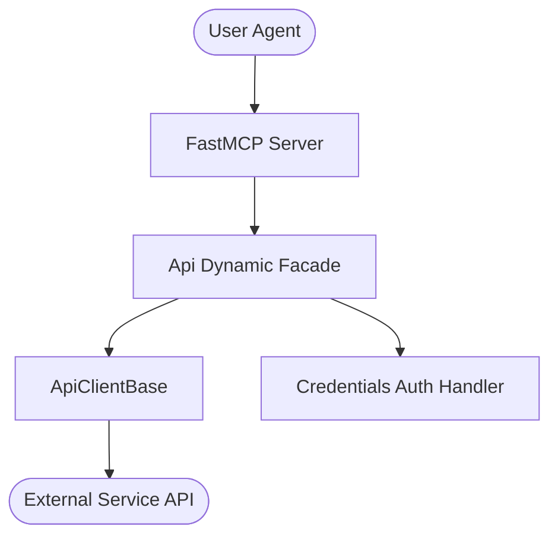

# Openbao MCP

[](https://github.com/genius-agents/openbao-mcp)
[](pyproject.toml)
[](LICENSE)

OpenBao Secrets and Encryption Key Vault orchestrator. Built with the highest architectural standards, incorporating dynamic facades, custom API routing, and FastMCP tool decoration.

## Table of Contents
- [Overview](#overview)
- [Features](#features)
- [Installation](#installation)
- [Usage](#usage)
- [Configuration](#configuration)
- [MCP Tools](#mcp-tools)
- [Architecture](#architecture)
- [Deployment](#deployment)
- [Contributing](#contributing)
- [License](#license)

---

## Overview

Openbao MCP provides a high-performance, model-optimized interface to Openbao capabilities. It isolates the model from underlying API transport complexity, ensuring safe, idempotent, and highly traceable system interactions.

---

## Features

- **Dynamic Facade Orchestration**: Integrates multi-inheritance clients cleanly under a single facade.
- **Battle-Tested Resilience**: Out-of-the-box credential authentication, connection polling, and request retry strategies.
- **FastMCP Declarative Tools**: Fast, native schema registration with full inline validation.
- **Complete Test Intent Diversity**: Deep, automated unit, integration, and mock tests ensuring high code coverage.

---

## Installation

Install in editable mode directly inside your active workspace:

```bash
pip install -e .[all]
```

Or via the `uv` tool:

```bash
uv pip install -e .
```

---

## Usage

You can launch the FastMCP server in stdio mode via Python module execution:

```python
import asyncio
from openbao_mcp.mcp_server import get_mcp_instance

async def main():
    mcp = get_mcp_instance()
    # Execute stdio loop or launch server
    print("MCP Server ready.")

if __name__ == "__main__":
    asyncio.run(main())
```

For direct shell launch, execute:

```bash
python -m openbao_mcp.mcp_server
```

---

## Configuration

The package is fully configurable via the environment variables listed below:

| Variable | Description | Default | Required |
|----------|-------------|---------|----------|
| `OPENBAO_URL` | OpenBao Secrets URL | `http://127.0.0.1:8200` | Yes |
| `OPENBAO_TOKEN` | Root or service account access token | `bao_root_token` | Yes |

A local template is supplied inside [.env.example](.env.example). Copy this file as `.env` and fill out your specific service endpoint parameters before starting execution.

---

## MCP Tools

The following declarative FastMCP tools are registered and available to upstream AI agents:

| Tool Name | Description | Parameters |
|-----------|-------------|------------|
| `read_secret` | Retrieve secret from Vault KV engine | `path: str` |
| `write_secret` | Write secret to Vault KV engine | `path: str, data: dict` |
| `get_health` | Get OpenBao system health status | None |

See [docs/overview.md](docs/overview.md) or [docs/concepts.md](docs/concepts.md) for deeper operational examples.

---

## Architecture

This package uses the standardized Agent-Utilities dynamic facade architecture:



---

## Deployment

### Bare-Metal (Standard pip)
1. Set up your Python virtual environment (>= 3.10).
2. Install the package: `pip install .[all]`
3. Export credentials:
   ```bash
   export OPENBAO_URL="http://127.0.0.1:8200"
   ```
4. Run: `python -m openbao_mcp.mcp_server`

### Container (Docker Compose)
A standard compose structure is provided inside the `docker/` folder. Build and deploy:

```bash
docker compose -f docker/compose.yml up --build -d
```

---

## Contributing

Please audit all code changes against ecosystem guidelines in [CONTRIBUTING.md](CONTRIBUTING.md) if available, and run:

```bash
pre-commit run --all-files
```

---

## License

This project is licensed under the MIT License. See the [LICENSE](LICENSE) file for complete details.
