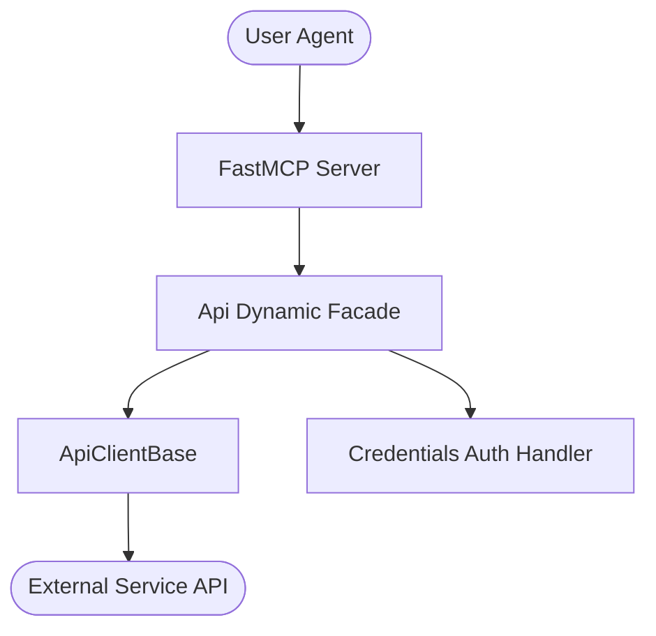

# Openbao MCP

[](https://github.com/genius-agents/openbao-mcp)
[](pyproject.toml)
[](LICENSE)

OpenBao Secrets and Encryption Key Vault orchestrator. Built with the highest architectural standards, incorporating dynamic facades, custom API routing, and FastMCP tool decoration.

> **Documentation** — Installation, deployment, usage across the API, CLI, and MCP
> interfaces, and guidance for provisioning the OpenBao backend are maintained in the
> [official documentation](https://knuckles-team.github.io/openbao-mcp/).

## Table of Contents
- [Overview](#overview)
- [Features](#features)
- [Installation](#installation)
- [Usage](#usage)
- [Configuration](#configuration)
- [MCP Tools](#mcp-tools)
- [Architecture](#architecture)
- [Deployment](#deployment)
- [Contributing](#contributing)
- [License](#license)

---

## Overview

Openbao MCP provides a high-performance, model-optimized interface to Openbao capabilities. It isolates the model from underlying API transport complexity, ensuring safe, idempotent, and highly traceable system interactions.

---

## Features

- **Dynamic Facade Orchestration**: Integrates multi-inheritance clients cleanly under a single facade.
- **Battle-Tested Resilience**: Out-of-the-box credential authentication, connection polling, and request retry strategies.
- **FastMCP Declarative Tools**: Fast, native schema registration with full inline validation.
- **Complete Test Intent Diversity**: Deep, automated unit, integration, and mock tests ensuring high code coverage.

---

## ⚙️ Dynamic Tool Selection & Visibility

This MCP server supports dynamic toolset selection and visibility filtering at runtime. This allows you to restrict the set of exposed tools in order to prevent blowing up the LLM's context window.

You can configure tool filtering via multiple input channels:

- **CLI Arguments:** Pass `--tools` or `--toolsets` (or their disabled counterparts `--disabled-tools` and `--disabled-toolsets`) during startup.
- **Environment Variables:** Define standard environment variables:
  - `MCP_ENABLED_TOOLS` / `MCP_DISABLED_TOOLS`
  - `MCP_ENABLED_TAGS` / `MCP_DISABLED_TAGS`
- **HTTP SSE Request Headers:** Pass custom headers during transport initialization:
  - `x-mcp-enabled-tools` / `x-mcp-disabled-tools`
  - `x-mcp-enabled-tags` / `x-mcp-disabled-tags`
- **HTTP SSE Request Query Parameters:** Append query parameters directly to your transport connection URL:
  - `?tools=tool1,tool2`
  - `?tags=tag1`

When query strings or parameters are supplied, an LLM-free **Knowledge Graph resolution layer** (using `DynamicToolOrchestrator`) matches query intents against known tool tags, names, or descriptions, with safe fallback and automated 24-hour background cache refreshing.


---

## Installation

> **Install the connector-focused `[mcp]` extra.** Examples use `openbao-mcp[mcp]` to add
> FastMCP / FastAPI through `agent-utilities[mcp]`; the required Agent Utilities core
> still carries `epistemic-graph[full]`. The `[agent]` extra additionally
> enables model orchestration.

Pick the extra that matches what you want to run:

| Extra | Installs | Use when |
|-------|----------|----------|
| `openbao-mcp[mcp]` | Connector-focused MCP server (`agent-utilities[mcp]` — FastMCP/FastAPI + `epistemic-graph[full]`) | You only run the **MCP server** (smallest install / image) |
| `openbao-mcp[agent]` | Agent runtime (`agent-utilities[agent-runtime,logfire]` — model orchestration + `epistemic-graph[full]`) | You run the **integrated A2A agent** |
| `openbao-mcp[all]` | Everything (`mcp` + `agent` + `logfire`) | Development / both surfaces |

```bash
# Connector-focused MCP server (includes the shared graph engine)
uv pip install "openbao-mcp[mcp]"

# Agent runtime (adds model orchestration to the shared graph engine)
uv pip install "openbao-mcp[agent]"

# Everything (development)
uv pip install "openbao-mcp[all]"      # or: python -m pip install "openbao-mcp[all]"
```

### Container images (`:mcp` vs `:agent`)

One multi-stage `docker/Dockerfile` builds two right-sized images, selected by `--target`:

| Image tag | Build target | Contents | Entrypoint |
|-----------|--------------|----------|------------|
| `example/openbao-mcp:mcp` | `--target mcp` | `openbao-mcp[mcp]` — **connector-focused**, includes `epistemic-graph[full]`; no model-orchestration stack | `openbao-mcp` |
| `example/openbao-mcp@sha256:<digest>` | `--target agent` (default) | `openbao-mcp[agent]` — **agent runtime**, model orchestration + `epistemic-graph[full]` | `openbao-agent` |

```bash
docker build --target mcp   -t example/openbao-mcp:mcp    docker/   # connector-focused MCP server
docker build --target agent -t example/openbao-mcp:agent-local docker/   # agent runtime
```

`docker/mcp.compose.yml` runs the connector-focused `:mcp` server; `docker/compose.yml` runs the
agent (`immutable agent digest`).

### Knowledge-graph database (`epistemic-graph`)

Both `[mcp]` and `[agent]` carry the **epistemic-graph** engine through the required
Agent Utilities core dependency (`epistemic-graph[full]`). The `[mcp]` extra keeps
the server connector-focused; `[agent]` additionally enables model orchestration. Local
deployments can use the bundled engine. For production or shared state, run
**epistemic-graph as a dedicated database service** and configure the runtime to use it.
Deployment recipes (single-node + Raft HA), connection configuration, and architecture
diagrams are documented in the
[epistemic-graph deployment guide](https://knuckles-team.github.io/epistemic-graph/deployment/).

---

## Usage

You can launch the FastMCP server in stdio mode via Python module execution:

```python
import asyncio
from openbao_mcp.mcp_server import get_mcp_instance

async def main():
    mcp = get_mcp_instance()
    # Execute stdio loop or launch server
    print("MCP Server ready.")

if __name__ == "__main__":
    asyncio.run(main())
```

For direct shell launch, execute:

```bash
python -m openbao_mcp.mcp_server
```

---

## Configuration

The package is fully configurable via the environment variables listed below:

| Variable | Description | Default | Required |
|----------|-------------|---------|----------|
| `OPENBAO_URL` | The primary URL of the OpenBao server. | `http://127.0.0.1:8200` | Yes |
| `OPENBAO_TOKEN` | Runtime-injected service account access token. | None | Yes |
| `BAO_ADDR` | Alias/fallback for the OpenBao server address. | None | No |
| `VAULT_ADDR` | Alias/fallback for the OpenBao/Vault server address. | None | No |
| `OPENBAO_MCP_BASE_URL` | Alternative fallback URL for user-level client endpoints. | `http://127.0.0.1:8200` | No |
| `OPENBAO_MCP_USERNAME` | Username for username/password authentication methods. | None | No |
| `OPENBAO_MCP_PASSWORD` | Password for username/password authentication methods. | None | No |
| `TLS_PROFILE` / `TLS_PROFILE_REF` | AgentConfig private-CA/mTLS transport selector; verification is mandatory. | None | No |
| `SECRETSTOOL` | Enable/disable Secrets Engine MCP tools namespace. | `True` | No |
| `SYSTOOL` | Enable/disable System Administration MCP tools namespace. | `True` | No |
| `AUTHTOOL` | Enable/disable Authentication Engine MCP tools namespace. | `True` | No |
| `SSHTOOL` | Enable/disable SSH Management MCP tools namespace. | `True` | No |

A local template is supplied inside [.env.example](.env.example). Copy this file as `.env` and fill out your specific service endpoint parameters before starting execution.

---

## MCP Tools

The following declarative FastMCP tools are registered and available to upstream AI agents. This table is auto-generated from the live server — do not edit by hand.

<!-- MCP-TOOLS-TABLE:START -->

#### Condensed action-routed tools (default — `MCP_TOOL_MODE=condensed`)

| MCP Tool | Toggle Env Var | Description |
|----------|----------------|-------------|
| `openbao_mcp_auth` | `AUTHTOOL` | Manage OpenBao auth operations. |
| `openbao_mcp_kv` | `SECRETSTOOL` | Manage OpenBao Key-Value v1 and v2 engines. |
| `openbao_mcp_logical` | `SECRETSTOOL` | Manage OpenBao logical operations. |
| `openbao_mcp_ssh` | `SSHTOOL` | Manage OpenBao SSH and SSH Helper operations. |
| `openbao_mcp_sys` | `SYSTOOL` | Manage OpenBao sys operations. |

#### Verbose 1:1 API-mapped tools (`MCP_TOOL_MODE=verbose` or `both`)

<details>
<summary>75 per-operation tools — one per public API method (click to expand)</summary>

| MCP Tool | Toggle Env Var | Description |
|----------|----------------|-------------|
| `openbao_AddHeader` | `CLIENTTOOL` | Invoke the AddHeader operation. |
| `openbao_Address` | `CLIENTTOOL` | Invoke the Address operation. |
| `openbao_Auth` | `CLIENTTOOL` | Invoke the Auth operation. |
| `openbao_CheckRetry` | `CLIENTTOOL` | Invoke the CheckRetry operation. |
| `openbao_ClearNamespace` | `CLIENTTOOL` | Invoke the ClearNamespace operation. |
| `openbao_ClearToken` | `CLIENTTOOL` | Invoke the ClearToken operation. |
| `openbao_ClientTimeout` | `CLIENTTOOL` | Invoke the ClientTimeout operation. |
| `openbao_Clone` | `CLIENTTOOL` | Invoke the Clone operation. |
| `openbao_CloneConfig` | `CLIENTTOOL` | Invoke the CloneConfig operation. |
| `openbao_CloneHeaders` | `CLIENTTOOL` | Invoke the CloneHeaders operation. |
| `openbao_CloneToken` | `CLIENTTOOL` | Invoke the CloneToken operation. |
| `openbao_CloneWithHeaders` | `CLIENTTOOL` | Invoke the CloneWithHeaders operation. |
| `openbao_CurrentWrappingLookupFunc` | `CLIENTTOOL` | Invoke the CurrentWrappingLookupFunc operation. |
| `openbao_DisableKeepAlives` | `CLIENTTOOL` | Invoke the DisableKeepAlives operation. |
| `openbao_Headers` | `CLIENTTOOL` | Invoke the Headers operation. |
| `openbao_Help` | `CLIENTTOOL` | Invoke the Help operation. |
| `openbao_HelpWithContext` | `CLIENTTOOL` | Invoke the HelpWithContext operation. |
| `openbao_KVv1` | `CLIENTTOOL` | Invoke the KVv1 operation. |
| `openbao_KVv2` | `CLIENTTOOL` | Invoke the KVv2 operation. |
| `openbao_Limiter` | `CLIENTTOOL` | Invoke the Limiter operation. |
| `openbao_Logical` | `CLIENTTOOL` | Invoke the Logical operation. |
| `openbao_MaxIdleConnections` | `CLIENTTOOL` | Invoke the MaxIdleConnections operation. |
| `openbao_MaxRetries` | `CLIENTTOOL` | Invoke the MaxRetries operation. |
| `openbao_MaxRetryWait` | `CLIENTTOOL` | Invoke the MaxRetryWait operation. |
| `openbao_MinRetryWait` | `CLIENTTOOL` | Invoke the MinRetryWait operation. |
| `openbao_Namespace` | `CLIENTTOOL` | Invoke the Namespace operation. |
| `openbao_NewClient` | `CLIENTTOOL` | Invoke the NewClient operation. |
| `openbao_NewLifetimeWatcher` | `CLIENTTOOL` | Invoke the NewLifetimeWatcher operation. |
| `openbao_NewRenewer` | `CLIENTTOOL` | Invoke the NewRenewer operation. |
| `openbao_NewRequest` | `CLIENTTOOL` | Invoke the NewRequest operation. |
| `openbao_OutputCurlString` | `CLIENTTOOL` | Invoke the OutputCurlString operation. |
| `openbao_OutputPolicy` | `CLIENTTOOL` | Invoke the OutputPolicy operation. |
| `openbao_RawRequest` | `CLIENTTOOL` | Invoke the RawRequest operation. |
| `openbao_RawRequestWithContext` | `CLIENTTOOL` | Invoke the RawRequestWithContext operation. |
| `openbao_SRVLookup` | `CLIENTTOOL` | Invoke the SRVLookup operation. |
| `openbao_SSH` | `CLIENTTOOL` | Invoke the SSH operation. |
| `openbao_SSHHelper` | `CLIENTTOOL` | Invoke the SSHHelper operation. |
| `openbao_SSHHelperWithMountPoint` | `CLIENTTOOL` | Invoke the SSHHelperWithMountPoint operation. |
| `openbao_SSHWithMountPoint` | `CLIENTTOOL` | Invoke the SSHWithMountPoint operation. |
| `openbao_SetAddress` | `CLIENTTOOL` | Invoke the SetAddress operation. |
| `openbao_SetBackoff` | `CLIENTTOOL` | Invoke the SetBackoff operation. |
| `openbao_SetCheckRedirect` | `CLIENTTOOL` | Invoke the SetCheckRedirect operation. |
| `openbao_SetCheckRetry` | `CLIENTTOOL` | Invoke the SetCheckRetry operation. |
| `openbao_SetClientTimeout` | `CLIENTTOOL` | Invoke the SetClientTimeout operation. |
| `openbao_SetCloneHeaders` | `CLIENTTOOL` | Invoke the SetCloneHeaders operation. |
| `openbao_SetCloneToken` | `CLIENTTOOL` | Invoke the SetCloneToken operation. |
| `openbao_SetDisableKeepAlives` | `CLIENTTOOL` | Invoke the SetDisableKeepAlives operation. |
| `openbao_SetHeaders` | `CLIENTTOOL` | Invoke the SetHeaders operation. |
| `openbao_SetLimiter` | `CLIENTTOOL` | Invoke the SetLimiter operation. |
| `openbao_SetLogger` | `CLIENTTOOL` | Invoke the SetLogger operation. |
| `openbao_SetMFACreds` | `CLIENTTOOL` | Invoke the SetMFACreds operation. |
| `openbao_SetMaxIdleConnections` | `CLIENTTOOL` | Invoke the SetMaxIdleConnections operation. |
| `openbao_SetMaxRetries` | `CLIENTTOOL` | Invoke the SetMaxRetries operation. |
| `openbao_SetMaxRetryWait` | `CLIENTTOOL` | Invoke the SetMaxRetryWait operation. |
| `openbao_SetMinRetryWait` | `CLIENTTOOL` | Invoke the SetMinRetryWait operation. |
| `openbao_SetNamespace` | `CLIENTTOOL` | Invoke the SetNamespace operation. |
| `openbao_SetOutputCurlString` | `CLIENTTOOL` | Invoke the SetOutputCurlString operation. |
| `openbao_SetOutputPolicy` | `CLIENTTOOL` | Invoke the SetOutputPolicy operation. |
| `openbao_SetPolicyOverride` | `CLIENTTOOL` | Invoke the SetPolicyOverride operation. |
| `openbao_SetSRVLookup` | `CLIENTTOOL` | Invoke the SetSRVLookup operation. |
| `openbao_SetToken` | `CLIENTTOOL` | Invoke the SetToken operation. |
| `openbao_SetWrappingLookupFunc` | `CLIENTTOOL` | Invoke the SetWrappingLookupFunc operation. |
| `openbao_Sys` | `CLIENTTOOL` | Invoke the Sys operation. |
| `openbao_Token` | `CLIENTTOOL` | Invoke the Token operation. |
| `openbao_WithNamespace` | `CLIENTTOOL` | Invoke the WithNamespace operation. |
| `openbao_WithRequestCallbacks` | `CLIENTTOOL` | Invoke the WithRequestCallbacks operation. |
| `openbao_WithResponseCallbacks` | `CLIENTTOOL` | Invoke the WithResponseCallbacks operation. |
| `openbao_delete_secret` | `APITOOL` | Delete a secret path. |
| `openbao_enable_mount` | `APITOOL` | Enable a secrets engine mount. |
| `openbao_get_health` | `APITOOL` | Get OpenBao engine health status. |
| `openbao_get_internal_openapi_spec` | `APITOOL` | Fetch dynamically compiled OpenAPI schema spec. |
| `openbao_get_mounts` | `APITOOL` | Get mounted secret engines. |
| `openbao_list_secrets` | `APITOOL` | List secrets under a path. |
| `openbao_read_secret` | `APITOOL` | Read a secret key-value path. |
| `openbao_write_secret` | `APITOOL` | Write a secret key-value path. |

</details>

_5 action-routed tool(s) (default) · 75 verbose 1:1 tool(s). Each is enabled unless its `<DOMAIN>TOOL` toggle is set false; `MCP_TOOL_MODE` selects the surface (`condensed` default · `verbose` 1:1 · `both`). Auto-generated — do not edit._
<!-- MCP-TOOLS-TABLE:END -->

See [docs/overview.md](docs/overview.md) or [docs/concepts.md](docs/concepts.md) for deeper operational examples.

---

## Architecture

This package uses the standardized Agent-Utilities dynamic facade architecture:


```mermaid
graph TD
    User([User Agent]) --> Server[FastMCP Server]
    Server --> Facade[Api Dynamic Facade]
    Facade --> ClientBase[ApiClientBase]
    Facade --> Auth[Credentials Auth Handler]
    ClientBase --> Service([External Service API])
```

---

## Deployment

### Bare-Metal (Standard pip)
1. Set up your Python virtual environment (>= 3.10).
2. Install the package: `pip install .[all]`
3. Export credentials:
   ```bash
   export OPENBAO_URL="http://127.0.0.1:8200"
   ```
4. Run: `python -m openbao_mcp.mcp_server`

### Container (Docker Compose)
A standard compose structure is provided inside the `docker/` folder. Build and deploy:

```bash
docker compose -f docker/mcp.compose.yml up -d    # :mcp server
docker compose -f docker/compose.yml up --build -d # local agent build
```

Or pull a prebuilt image:

```bash
docker pull example/openbao-mcp:mcp      # connector-focused MCP server
docker pull example/openbao-mcp@sha256:<digest>   # agent runtime (default)
```

> The `:mcp` tag is the **MCP-serving image** (`docker/Dockerfile --target mcp`,
> installing `openbao-mcp[mcp]`); the default the immutable agent image is the **full agent image**
> (`--target agent`, `openbao-mcp[agent]`) which also bundles the Pydantic AI agent and
> the epistemic-graph engine. See [Container images](#container-images-mcp-vs-agent).

---

<!-- BEGIN GENERATED: additional-deployment-options -->
### Additional Deployment Options

`openbao-mcp` can run as a local stdio process or container, or behind a remote
network boundary. The
[Deployment guide](https://knuckles-team.github.io/openbao-mcp/deployment/) carries
the detailed transport contract.

- **Local container** — launch a reviewed immutable image as a least-privilege
  stdio child with no listener or published port.
- **Remote URL** — connect through an operator-supplied authenticated HTTPS
  ingress. Keep its URL, outbound identity references, trust profile, and exact
  `MCP_ALLOWED_HOSTS` in `AgentConfig`.
<!-- END GENERATED: additional-deployment-options -->

## Documentation

The complete documentation is published as the
[official documentation site](https://knuckles-team.github.io/openbao-mcp/) and is the
recommended reference for installation, deployment, and day-to-day operation.

| Page | Contents |
|---|---|
| [Installation](https://knuckles-team.github.io/openbao-mcp/installation/) | pip, source, extras, prebuilt Docker image |
| [Deployment](https://knuckles-team.github.io/openbao-mcp/deployment/) | run the MCP server, the agent server, Compose, Caddy + Technitium, env config |
| [Usage](https://knuckles-team.github.io/openbao-mcp/usage/) | the MCP tools, the `Api` client, example prompts |
| [Backing Platform](https://knuckles-team.github.io/openbao-mcp/platform/) | deploy OpenBao with Docker |
| [Overview](https://knuckles-team.github.io/openbao-mcp/overview/) | architecture and the dynamic facade |
| [Concepts](https://knuckles-team.github.io/openbao-mcp/concepts/) | concept registry (`CONCEPT:BAO-*`) |

`AGENTS.md` is the canonical contributor/agent guidance.

## Contributing

Please audit all code changes against the repository's contribution and review requirements, and run:

```bash
pre-commit run --all-files
```

---

## License

This project is licensed under the MIT License. See the [LICENSE](LICENSE) file for complete details.


<!-- BEGIN agent-utilities-deployment (generated; do not edit between markers) -->

## Deploy with `agent-utilities-deployment`

Provision this package with the consolidated **`agent-utilities-deployment`**
workflow. It selects an installed-package, editable-source, or immutable-container
path; records only runtime secret and TLS-profile references in `AgentConfig`; and
runs doctor, registration, policy, observability, and rollback gates. Ask your agent
to **"deploy `openbao-mcp` with agent-utilities-deployment"**.

| Install mode | Command |
|------|---------|
| Installed package | `uv tool install "openbao-mcp[mcp]"`, then run `openbao-mcp` |
| Editable source | `uv pip install -e ".[agent]"`, then run `openbao-mcp` |
| Immutable container | deploy `registry.example.invalid/openbao-mcp@sha256:<digest>` through the operator-selected orchestrator |

The repository embeds no deployment profile, credential value, certificate path, or
environment-specific endpoint. Supply those at runtime through `AgentConfig` and the
configured secret provider.

<!-- END agent-utilities-deployment -->

## Environment Variables

<!-- ENV-VARS-TABLE:START -->

#### Package environment variables

| Variable | Example | Description |
|----------|---------|-------------|
| `OPENBAO_URL` | `http://127.0.0.1:8200` | The primary URL of the OpenBao server. |
| `OPENBAO_TOKEN` | secret-injected | Root or service account access token. |
| `BAO_ADDR` | `http://127.0.0.1:8200` | Fallback address aliases for OpenBao / Vault endpoints. |
| `VAULT_ADDR` | `http://127.0.0.1:8200` |  |
| `OPENBAO_MCP_BASE_URL` | `http://127.0.0.1:8200` | Alternative base URL fallback for user-level client endpoints. |
| `OPENBAO_MCP_USERNAME` | — | Client credentials for user authentication methods. |
| `OPENBAO_MCP_PASSWORD` | secret-injected |  |
| `TLS_PROFILE` | `private-ca` | AgentConfig named transport profile |
| `TLS_PROFILE_REF` | `secret://transport/provider` | Direct runtime profile reference |
| `TLS_PROFILES_REF` | `secret://transport/catalog` | Named runtime profile catalog |
| `SECRETSTOOL` | `True` | Set to True/False to enable or disable specific tool categories in the MCP server. |
| `SYSTOOL` | `True` |  |
| `AUTHTOOL` | `True` |  |
| `SSHTOOL` | `True` |  |

#### Inherited agent-utilities variables (apply to every connector)

| Variable | Example | Description |
|----------|---------|-------------|
| `TRANSPORT` | `stdio` | MCP transport: `stdio` \| `streamable-http` \| `sse` |
| `HOST` | `127.0.0.1` | Loopback bind host (set an authenticated ingress explicitly) |
| `PORT` | `8000` | Bind port (HTTP transports) |
| `MCP_TOOL_MODE` | `intent` | Tool surface: `intent` \| `condensed` \| `verbose` \| `both` |
| `MCP_ENABLED_TOOLS` | — | Comma-separated tool allow-list |
| `MCP_DISABLED_TOOLS` | — | Comma-separated tool deny-list |
| `MCP_ENABLED_TAGS` | — | Comma-separated tag allow-list |
| `MCP_DISABLED_TAGS` | — | Comma-separated tag deny-list |
| `EUNOMIA_TYPE` | `none` | Authorization mode: `none` \| `embedded` \| `remote` |
| `EUNOMIA_POLICY_FILE` | `mcp_policies.json` | Embedded Eunomia policy file |
| `EUNOMIA_REMOTE_URL` | — | Remote Eunomia authorization server URL |
| `ENABLE_OTEL` | `False` | Enable OpenTelemetry export |
| `OTEL_EXPORTER_OTLP_ENDPOINT` | — | OTLP collector endpoint |
| `MCP_CLIENT_AUTH` | — | Outbound MCP child auth: `oidc-client-credentials` \| `basic` \| `none` |
| `OIDC_CLIENT_ID` | — | OIDC client id (service-account auth) |
| `OIDC_CLIENT_SECRET_REF` | `secret://identity/oidc-client-secret` | Runtime secret reference for the OIDC service account |
| `MCP_BASIC_AUTH_USERNAME` | — | HTTP Basic username (`MCP_CLIENT_AUTH=basic`) |
| `MCP_BASIC_AUTH_PASSWORD_REF` | `secret://identity/mcp-basic-password` | Runtime secret reference for HTTP Basic auth (`MCP_CLIENT_AUTH=basic`) |
| `DEBUG` | `False` | Verbose logging |
| `PYTHONUNBUFFERED` | `1` | Unbuffered stdout (recommended in containers) |
| `MCP_URL` | `http://localhost:8000/mcp` | URL of the MCP server the agent connects to |
| `PROVIDER` | `openai` | LLM provider for the agent |
| `MODEL_ID` | `gpt-4o` | Model id for the agent |
| `ENABLE_WEB_UI` | `True` | Serve the AG-UI web interface |

_14 package + 24 inherited variable(s). Auto-generated from `.env.example` + the shared agent-utilities set — do not edit._
<!-- ENV-VARS-TABLE:END -->

<!-- GOVERNED-CAPABILITY:START -->
## Governed capability contract

This package ships a compact canonical skill surface with specialist procedures
kept as referenced workflows. The current MCP tools, skill metadata,
`connector_manifest.yml`, ontology, mappings, shapes, fixtures, migrations,
tool-schema fingerprints, and certification metadata form one versioned
capability contract. Validate them together; do not rely on stale tool names or
historical per-task skill wrappers.

Runtime endpoints, credentials, certificate trust, tenant identity, retention,
and observability policy are deployment inputs and are never packaged values.
See [Configuration, trust, and privacy](docs/configuration.md) before enabling a
network transport, connector ingestion, GraphOS delegation, or trace export.
<!-- GOVERNED-CAPABILITY:END -->
